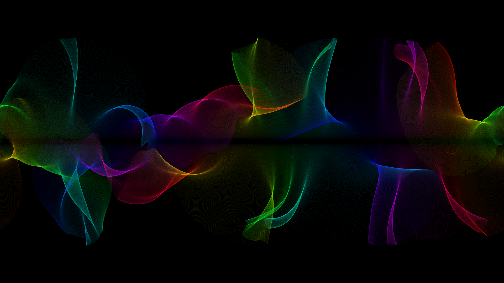
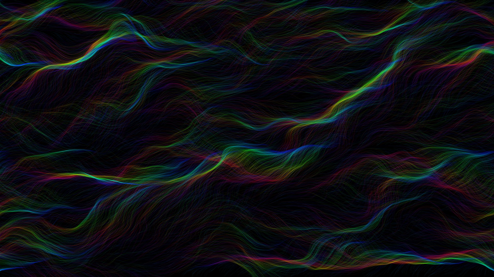
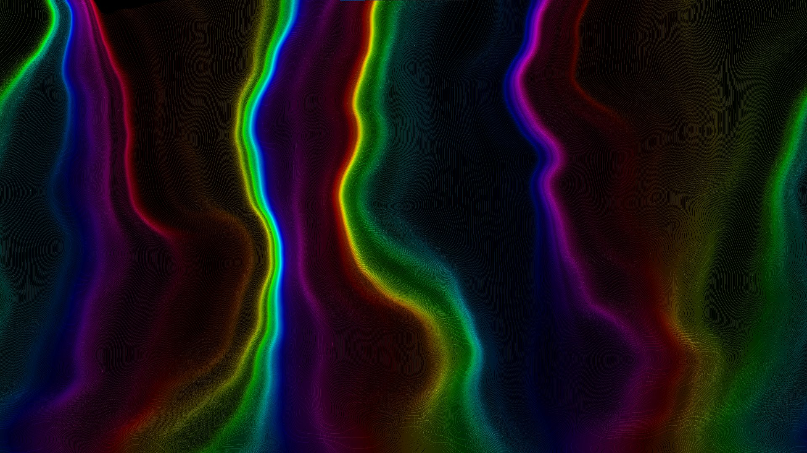

# Background

These Processing programs can create beautiful, colorful, abstract wallpapers within a few seconds.

Images are generated by moving tens of thousands of transparent dots that leave a trace behind.
I used Perlin noise to achieve continiously changing random movement.

Some examples:

